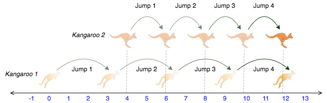

# Saltos en la recta (Number line jumps)

Dueño: Joan Rojas
Tags: Algoritmia

### Enunciado

Estás coreografiando un espectáculo de circo con varios animales. Para el primer acto, tienes dos canguros en una recta numérica dispuestos a saltar en dirección positiva (es decir, hacía el infinito positivo).

- El primer canguro parte en la posición `x1` y se desplaza a razón de `v1` metros por salto.
- El segundo canguro parte en la posición `x2` y se desplaza a razón de `v2` metros por salto.

Tienes que encontrar la manera de que ambos canguros estén en el mismo lugar al mismo tiempo como parte del espectáculo. Si es posible, retorna `YES`, de lo contrario devuelva `NO`.

### Ejemplo

```
x1 = 2
v1 = 1
x2 = 1
v2 = 1
```

Después de un salto ambos están en x = 3, (x1 + v1 = 2 + 1, x2 + v2 = 1 + 2), entonces la respuesta es `YES`.

### Descripción de la función

Complete la función, esta recibe los siguientes parámetros:

- `int` x1, v1: posición de partida y distancia del salto del canguro 1.
- `int` x2, v2: posición de partida y distancia del salto del canguro 2.

Retorna: `string` `YES` o `NO`.

### Formato de entrada

Una línea de cuatro números enteros separados por espacios que denotan los valores respectivos de `x1`, `v1`, `x2` y `v2`.

### Restricciones

- 0 ≤ x1 <0 x2 10000
- 1 ≤ v1 ≤ 10000
- 1 ≤ v2 ≤ 10000

### Ejemplo de entrada 1

```
0 3 4 2
```

### Ejemplo de salida 2

```
YES
```

### Explicación 1

Los dos canguros saltan a través de la siguiente secuencia de lugares:

De la imagen se entiende que los canguros se encuentran en el mismo lugar (número 12 de la recta) tras el mismo número de salto (4 saltos), entonces se imprime `YES`.



### Ejemplo de entrada 2

```
0 2 5 3
```

### Ejemplo de salida 2

```
NO
```

### Explicación 2

El **segundo** canguro tiene una posición inicial que está por delante (más a la derecha) de la posición inicial del **primer** canguro (es decir, `x2 > x1`). Como el segundo canguro se mueve a mayor velocidad (es decir, `v2 > v1`) y ya está por delante del primero, este nunca podrá alcanzarlo por lo tanto se imprime `NO`.

## Mi código para resolverlo

- C#

```csharp
public static string kangaroo(int x1, int v1, int x2, int v2)
{
    if(v1 > v2 && ((x2 -x1) % (v1 - v2) == 0))
    {
        return "YES";
    }
    else
    {
        return "NO";
    }
}
```